# Bot Framework Composer の基礎 - 2 (機能追加)

[前のステップ](02_composer_basic.md) では、Bot アプリケーションの最も基本的なものとして、オウム返し Bot を作成しました。

続いて、この Bot アプリケーションに二つの機能を追加してみます。

- 挨拶メッセージを返す機能
- ヘルプメッセージを返す機能

メッセージとしてはどちらもシンプルなものですが、Bot アプリケーションを拡張する重要な操作です。

[1. 挨拶メッセージの確認](#%e6%8c%a8%e6%8b%b6%e3%83%a1%e3%83%83%e3%82%bb%e3%83%bc%e3%82%b8%e3%81%ae%e7%a2%ba%e8%aa%8d)  
[2. 挨拶メッセージの変更](#%e6%8c%a8%e6%8b%b6%e3%83%a1%e3%83%83%e3%82%bb%e3%83%bc%e3%82%b8%e3%81%ae%e5%a4%89%e6%9b%b4)
[3. ヘルプ ダイアログの追加](#%e3%83%98%e3%83%ab%e3%83%97-%e3%83%80%e3%82%a4%e3%82%a2%e3%83%ad%e3%82%b0%e3%81%ae%e8%bf%bd%e5%8a%a0)  
[4. ヘルプ ダイアログへの切り替え](#%e3%83%98%e3%83%ab%e3%83%97-%e3%83%80%e3%82%a4%e3%82%a2%e3%83%ad%e3%82%b0%e3%81%b8%e3%81%ae%e5%88%87%e3%82%8a%e6%9b%bf%e3%81%88)  
[5. Bot Framework Emulator で動作確認](#bot-framework-emulator-%e3%81%a7%e5%8b%95%e4%bd%9c%e7%a2%ba%e8%aa%8d)

---

## 挨拶メッセージの確認

前のステップで確認した通り、ユーザーがチャットクライアントを起動した時に挨拶メッセージを返す機能を持っています。

Bot アプリケーションが挨拶メッセージを返すのは

- Bot が動作していることを知らせる
- Bot の機能を知らせる
- ユーザーが最初に何をできるのかを知らせる

などが目的です。

> "Greetring" は "**Conversation Update** activity" に分類される Trigger です。  
> ユーザーがチャットクライアントに何かを入力した際には発生しないアクティビティです。
>  
> Conversation Update は、
>
> - Bot が対話に入る
> - ユーザーが対話に入る
>
> タイミングで発生します。

1. "**MyQnaBot**" の [**Greeting**] Trigger を選択します。

   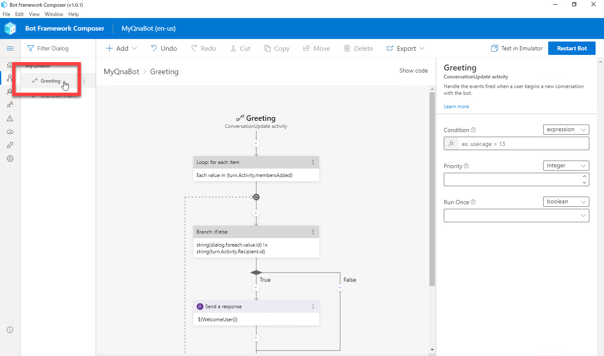

2. "**Send a response**" アクションを選択します。

3. [**Language Generation**] の定義を確認します。  
   以下の内容になっているはずです。

   ```txt
   - ${WelcomeUser()}
   ```

   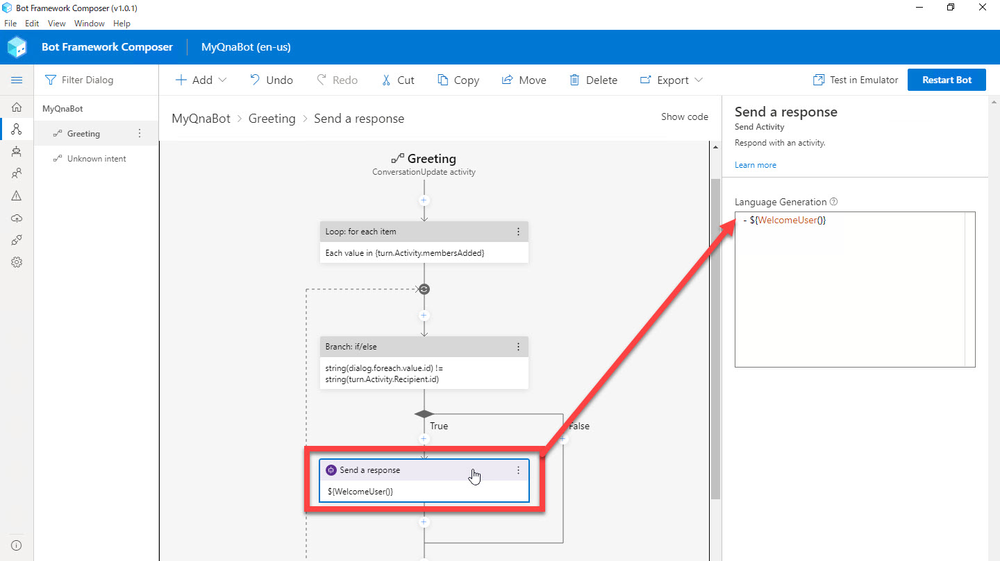

4. "**WelcomeUser()**" の部分でマウスホバーします。  
   以下の内容がポップアップ表示されます。

   ```txt
   - Welcome to the EmptyBot sample
   ```

   これが挨拶メッセージとして返されるものです。  
   前のステップで Bot Framework Emulator で確認したものと同じです。

   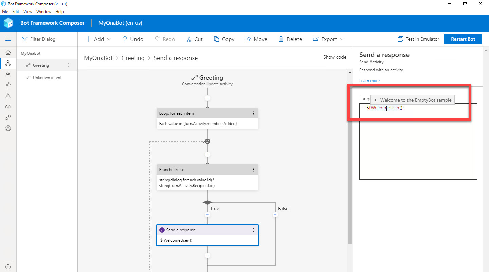

5. 挨拶メッセージが定義されている場所を確認します。  
   [**Bot Response**] - [**All**] に "#WelcomeUser" テンプレートが定義されていることを確認します。

   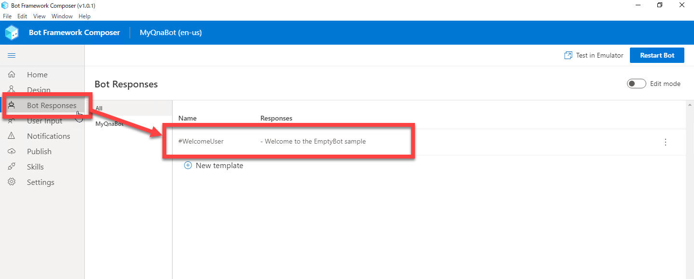

---

## 挨拶メッセージの変更

1. 挨拶メッセージを変更します。  
   [**Edit mode**] を有効にします。

2. "**WelcomeUser**" の定義を以下の内容に変更します。

   ```txt
   # WelcomeUser
   - こんにちは、Echo Bot です
   - ようこそ、Echo Bot へ
   ```

   

   メッセージの内容を2行にしたことにより、ランダムでどちらかのメッセージを返すようになります。

3. 挨拶メッセージが変更されることを Emulator で確認します。  
   [Start Bot] または [Restart Bot] をクリックして、Bot を起動します。  

   

4. Bot が起動したら Bot Framework Emulator を開きます。

   [**Restart Conversation - New User ID**] を何度かクリックして、ランダムに挨拶メッセージが変わることを確認します。

   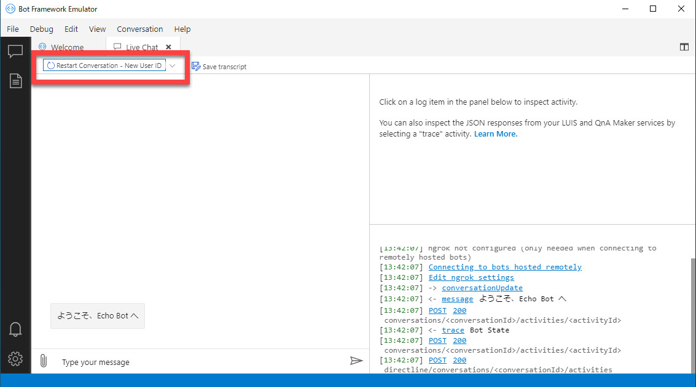

   [Restart Conversation] は、ユーザーと Bot との対話を再起動することを意味します。  
   対話が新しく始まるので、そのたびに挨拶メッセージを見ることができます。

   > [Unknown intent] の [Send a resonse] アクションは、[Language Generation] に挨拶メッセージを直接記述しました。  
   > これも [**Bot Response**] で定義するほうが保守性が向上します。  
   >
   > この [Send a response] アクションはハンズオンの後の手順で削除します。このため、今回は先ほど作成したままにしておきます。

---

## ヘルプ ダイアログの追加

Bot にヘルプメッセージを応答する機能を追加します。

まず **ヘルプ ダイアログを Bot に追加** します。

> ダイアログは一般的には、他から独立した一連の対話を定義するために使用します。
>
> ここでの手順は一つのメッセージを応答するだけなので、必ずしもダイアログにする必要はありません。  
>
> またオウム返し Bot でヘルプ機能は不要だと思いますが、今回はダイアログの定義と呼び出し方とを理解するために、シンプルな処理ですがダイアログを使うことにします。

1. [**Bot Response**] にヘルプメッセージを定義します。  
   [Bot Response] を選択して [**Edit mode**] に変更します。  
   以下の "**ShowHelp**" 定義を追加します。

   ````txt
   - ```Azure についての疑問に答えます。

   質問を入力してください。
   ```
   ````

   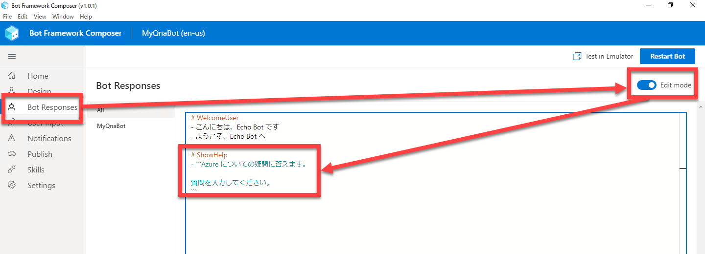

   > **```** (バッククォート 3個) で囲むことで、複数行メッセージを定義できます。

2. [**Dialog Flow**] - [**+ Add**] - [**Add new dialog**] を選択します。  

   

3. [**Name**] にダイアログの名前を入力します。  
   今回は "**Help**" とします。

   

4. [**+**] をクリックして、続いて [**Send a message**] をクリックします。

   

5. [**Send a response**] をクリックして、Property の [**Language Generation**] に以下を入力します。

   ```txt
   - ${ShowHelp()}
   ```

   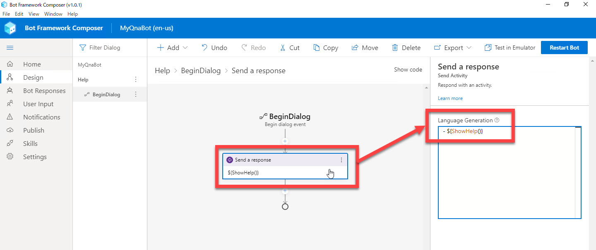

---

## ヘルプ ダイアログへの切り替え

ユーザーの入力は "**MyQnaBot**" が受け取ります。  
ヘルプメッセージを表示するには、メインからヘルプ ダイアログへの **コンテキスト切り替え** が必要です。

1. "**MyQnaBot**" を選択して、Property の [**Recognizer Type**] で "**Regular Expression**" を選択します。

   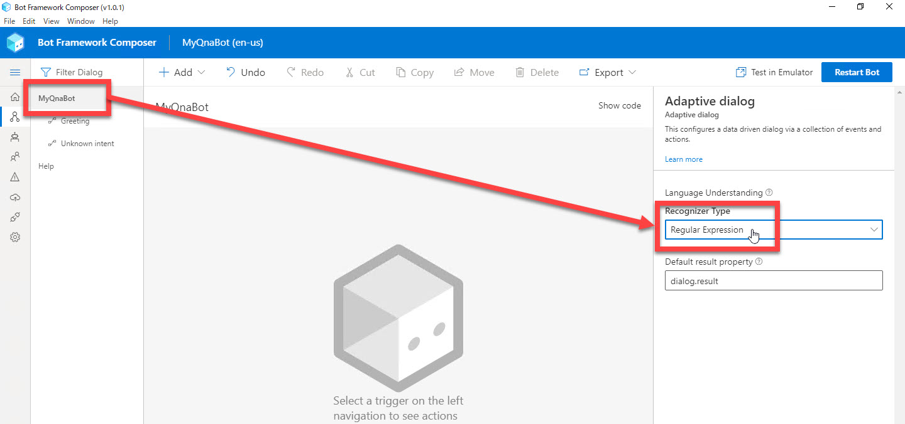

   > 今までは Intent（＝意図、ユーザーが Bot に何をさせようとしているのか）を分類するルールを持っていませんでした。  
   > この手順で正規表現でユーザー入力の Intent を分類するようになりました。

2. ヘルプダイアログを呼び出すための Trigger を "**MyQnaBot**" に追加します。  
   [**+ Add**] - [**Add new trigger on MyQnaBot**] を選択します。

   

3. "MyEchoBot.Main" で [**New Trigger**] を選択します。  
   [**Create a trigger**] ダイアログが開いたら、以下を入力・選択をします。

   |項目名|値|
   |---|---|
   |トリガーの種類|Intent recognized|
   |トリガー名|ここでは "**Help**"|
   |正規表現のパターン|(?i)(?:help\|ヘルプ\|使い方)|

   

4. [**+**] をクリックして、続いて [**Dialog Management**] - [**Begin a new dialog**] をクリックします。

   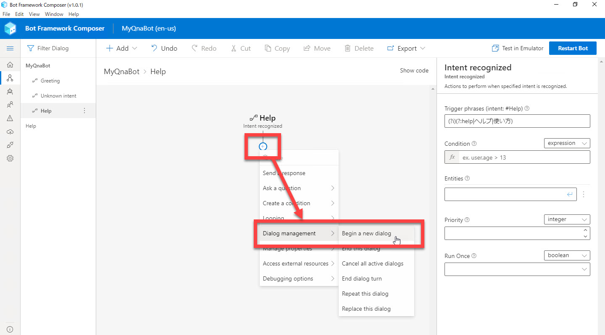

5. [**Begin a new dialog**] アクションの Property の [**Dialog name**] で "**Help**" を選択します。

   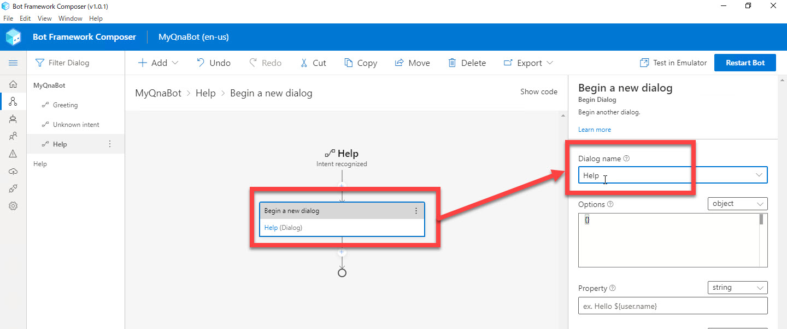

---

## Bot Framework Emulator で動作確認

以上でオウム返し Bot の拡張が終わりました。  
Bot Framework Emulator で動作を見てみます。

1. [Start Bot] または [Restart Bot] をクリックします。

2. Bot が起動したら Bot Framework Emulator を開きます。

3. 以下を参考に入力して、Bot が期待した応答を返すことを確認します。

   |入力|応答|
   |---|---|
   |（※対話開始時）|"こんにちは、Echo Bot です" または "ようこそ、Echo Bot へ"|
   |help|ユーザーの入力をオウム返しします|
   |Help|ユーザーの入力をオウム返しします|
   |HELP|ユーザーの入力をオウム返しします|
   |ヘルプ|ユーザーの入力をオウム返しします|
   |使い方|ユーザーの入力をオウム返しします|
   |任意の入力|「(入力した内容)」と言いましたね|

   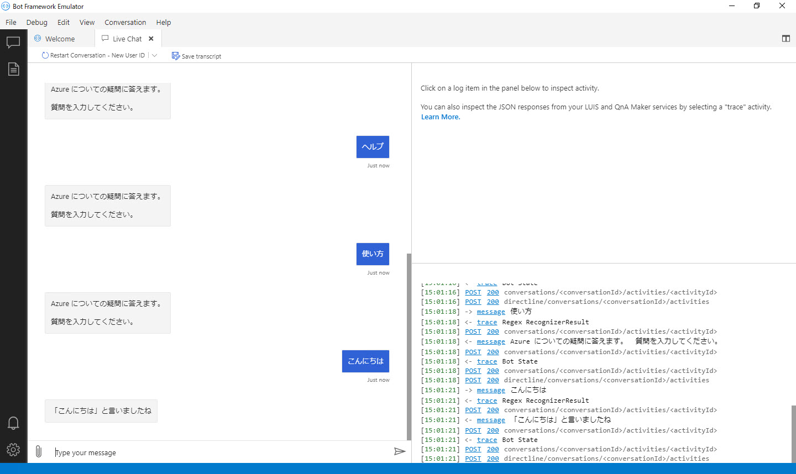

   > Intent の分類が比較的簡単なルールの場合には、[**Recognizer Type**] を "**Regular Expression**" にすることができます。  
   >
   > ユーザーに自由な入力を認める場合は **LUIS (Language Understanding)** で分類する必要があります。（例えば「ヘルプ」以外に「このBotの使い方」や「ボットの機能」など）  
   > LUIS についてはあとのステップで取り上げます。 

---

以上で、Bot アプリケーションの重要な機能拡張の手順を理解できたと思います。  
次のステップから Q&A Bot を作っていきます。まずは QnA Maker でナレッジベースを作るところからです。

[前に戻る](02_composer_basic.md) | [次に進む](04_create_qnamaker_knowledgebase.md)  
[目次に戻る](../README.md)